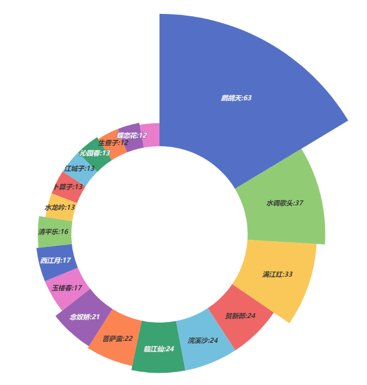
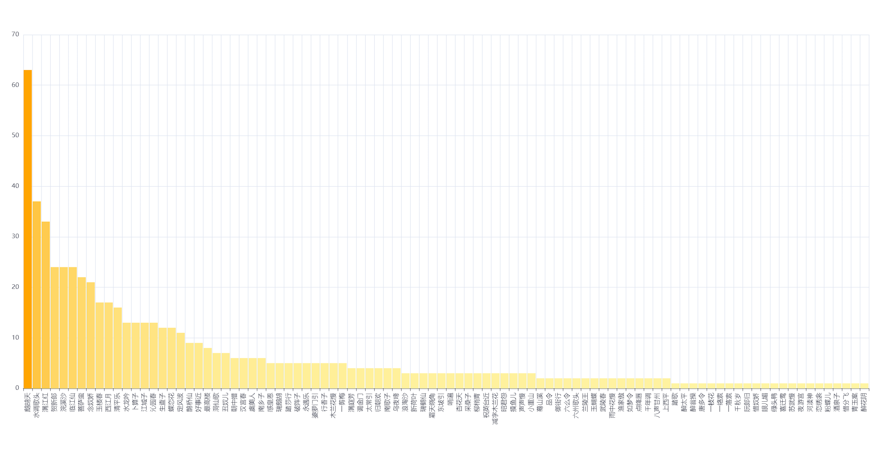

此库专门存储辛弃疾(稼轩)的诗词，并确定了每一首的唯一性和准确性。补全了网上很多由于编码问题存在□的问题。
## 词牌名
categories =['浪淘沙', '感皇恩', '新荷叶', '满庭芳', '瑞鹤仙', '瑞鹧鸪', '蓦山溪', '鹊桥仙', '踏莎行', '踏歌', '醉太平', '醉翁操', '鹧鸪天', '唐多令', '霜天晓角',\
 '一枝花', '一络索', '一落索', '千秋岁', '东坡引', '阮郎归', '破阵子', '哨遍', '品令', '惜奴娇', '眼儿媚', '绿头鸭', '谒金门', '喜迁莺', '御街行', '最高楼', '朝中措', \
 '六么令', '六州歌头', '太常引', '水调歌头', '兰陵王', '归朝欢', '永遇乐', '玉蝴蝶', '杏花天', '苏武慢', '夜游宫', '定风波', '汉宫春', '武陵春', '河渎神', '采桑子', \
 '雨中花慢', '南歌子', '柳梢青', '洞仙歌', '祝英台近', '贺新郎', '浣溪沙', '恋绣衾', '粉蝶儿', '酒泉子', '减字木兰花', '婆罗门引', '惜分飞', '昭君怨', '玉楼春', '生查子',\
  '好事近', '行香子', '木兰花慢', '渔家傲', '青玉案', '满江红', '如梦令', '醉花阴', '虞美人', '水龙吟', '卜算子', '菩萨蛮', '临江仙', '江城子', '蝶恋花', '凤凰台上忆吹箫', \
  '念奴娇', '西江月', '南乡子', '暗香', '摸鱼儿', '沁园春', '长相思', '声声慢', '点绛唇', '清平乐', '瑞龙吟', '一剪梅', '千年调', '丑奴儿', '八声甘州', '小重山', '上西平', '乌夜啼']
## 词牌名使用频率

    

